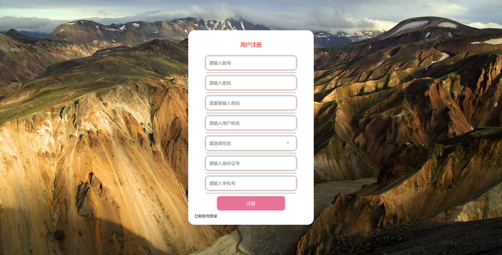

<h1 align="center">基于SpringBoot+Vue的反欺诈平台系统【带论文】</h1>

- <b>完整代码获取地址：从戎源码网 ([https://armycodes.com/](https://armycodes.com/))</b>
- <b>技术探讨、资料分享，请加QQ群：692619798</b>
- <b>作者微信：19941326836  QQ：952045282</b>
- <b>承接计算机毕业设计、Java毕业设计、Python毕业设计、深度学习、机器学习</b>
- <b>选题+开题报告+任务书+程序定制+安装调试+论文+答辩ppt 一条龙服务</b>
- <b>所有选题地址 ([https://github.com/Descartes007/allProject](https://github.com/Descartes007/allProject)) </b>

## 一、项目介绍

基于SpringBoot+Vue的反欺诈平台，系统角色为管理员、前台用户，主要功能如下
### 管理员：
- 基本操作：登录、修改密码、获取个人信息、修改个人信息
- 配置管理：查看网站配置、修改网站配置
- 数据字典管理：反诈视频分类、新闻类型、性别、论坛状态、收藏类型的新增、删除、修改、查询
- 反诈视频管理：筛选视频、获取视频列表、查看视频详情、新增视频、删除视频、修改视频、上传封面/文件
- 反诈视频收藏管理：获取收藏列表、筛选收藏、查看收藏详情、删除收藏
- 反诈视频留言管理：获取留言列表、筛选留言、查看留言详情、删除留言
- 论坛管理：筛选帖子、获取帖子列表、查看帖子详情、新增/编辑帖子、删除帖子、设置帖子状态
- 新闻公告管理：发布新闻、获取新闻列表、筛选新闻、查看新闻详情、编辑新闻、删除新闻
- 用户管理（前台用户）：筛选用户信息、查看用户详情、修改用户信息、删除用户信息、重置密码
- 系统用户管理（管理员）：新增管理员、获取管理员列表、查看管理员信息、修改管理员信息、删除管理员
- 文件管理：文件上传与下载（图片/视频等资源）]
### 前台用户：
- 基本操作：注册、登录、修改密码、获取个人信息、修改个人信息
- 反诈视频：浏览/筛选视频、查看视频详情、收藏/取消收藏、留言评论、查看我的收藏
- 论坛：发布帖子、浏览帖子、查看帖子详情、评论互动、管理个人帖子
- 新闻公告：浏览新闻、查看新闻详情
- 个人中心：查看与修改个人资料、头像上传、密码修改、查看我的留言与收藏

## 二、项目技术

- 编程语言：Java
- 项目架构：B/S架构
- 前端技术：Vue 2、ElementUI、Vue Router、Vuex、Axios
- 后端技术：SpringBoot、MyBatis、MyBatis-Plus、Hibernate Validator、Maven、MySQL

## 三、运行环境

- JDK版本：1.8及以上都可以
- 操作系统：Windows7/10、MacOS
- 开发工具：IDEA、Ecplise、MyEclipse都可以

## 四、数据库配置文件

- npm版本：6.14.13及以上都可以
- Redis版本：3.2.100及以上都可以
- 文件名：application.yml
- 编码类型：utf8

## 论文截图

## 系统截图

